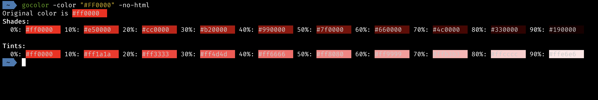
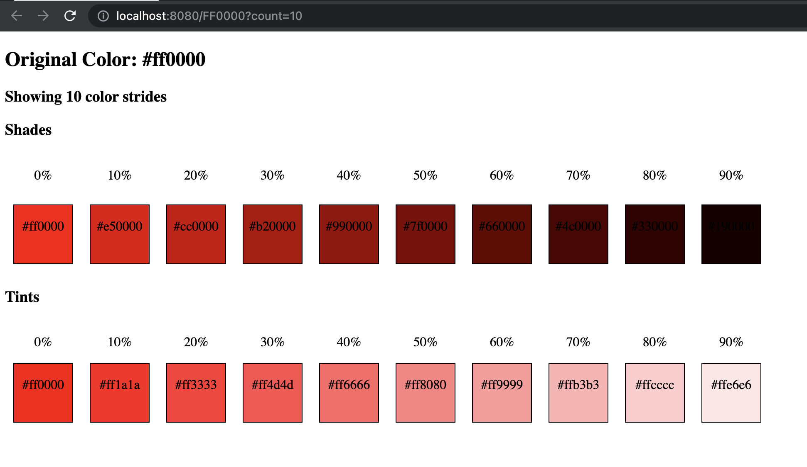

# gocolor 
gocolor is a simple tool that generates Shades and Tints of a given color.

## Description
Ideally, this repository contains exported libraries that helps with color manipulations.  
However, it was built as a tool to generate shades and tints of a given color.

## Installation
### Easy way
To install gocolor, simply download the binary from the [releases](https://github.com/varsityscape/gocolor/releases) page and place it in your PATH.

### Alternatives
#### MacOS
```bash
brew tap varsityscape/varsityscape
brew install varsityscape/varsityscape/gocolor
```
#### Go Install
You can also install gocolor using go install (if you have go installed):
```bash
go install github.com/varsityscape/gocolor/cmd/gocolor@latest
```

## Usage
```bash
gocolor -h
# Usage of gocolor:
#   -color string
#         color to display without # (default "fff")
#   -count int
#         number of shades and tints to generate (default 10)
#   -no-html
#         disable html output
#   -port string
#         port to listen on (default "8080")
```
The app can be used in two major ways (depending on the presence of the `-no-html` flag):
1. Quickly generate shades and tints from the CLI
2. Run a local web server that hosts a web interface to generate shades and tints

#### CLI
To use the CLI, a typical command would look like this:
```bash
gocolor -color "#FF0000" -no-html
```



#### Web Server
To use the web server, a typical command would look like this:
```bash
gocolor -port 8080 -color FF0000 -count 10
```
Then, you can visit `http://localhost:8080/FF0000?count=10` to see the web interface.  



> **NOTE** that editing the URL address bar will change the color and count.

### Summary
| Flag       | Description                                                                                                                       | Default |
|------------|-----------------------------------------------------------------------------------------------------------------------------------|---------|
| `-color`   | Color to generate shades and tints of. <br/>To be safe do not add "#" as a prefix.<br/> "#" can be added when running in cli mode | `fff`   |
| `-count`   | The number of shades / tints to generate                                                                                          | 10      |
| `-no-html` | Disable the web server and only generate shades and tints in the CLI                                                              | false   |
| `-port`    | Port to listen on when running the web server                                                                                     | 8080    |

## Contributing
Contributions are welcome!

## License
[MIT](./LICENSE)

## Author
- [Evans Owamoyo](https://github.com/lordvidex/)
